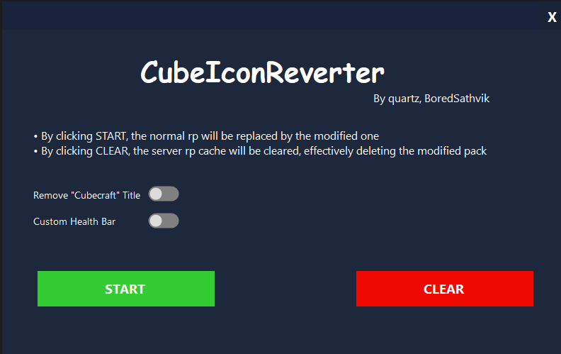

# CubeIconReverter

### something to revert the ugly new Icons in CubeCraft

[Download here](https://github.com/quartzexpressDEV/CubeIconReverter/releases/latest) | [Discord](https://discord.gg/tW2NuJyJTs)

 

## Usage

- Toggle the options you what you want  
     

- Press to start downloading the pack  
     

- Press clear to reset the pack so it will use the default CubeCraft pack  
    

## Disclaimer

- we use an edited version of the cubecraft texture pack in this app.  
  if you get sued don't blame us :P 
  Also don't sue us, Thank you.  

## Issues

- If you have any issues with the App open an new issue
- or join the discord [here](https://github.com/quartzexpressDEV/CubeIconReverter/stargazers)  

## Contributation

- If you want to improve it or fix a bug, open an new pull request
